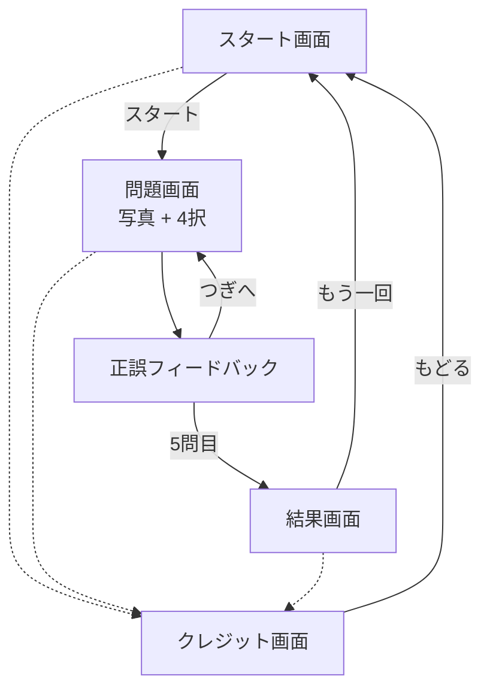

# 機能一覧

## 機能説明
- 写真クイズ: 東京区間のある路線から出題し、4択で回答
- 進捗表示: 現在の問題数を表示
- 結果表示: 正解数とおさらい一覧
- クレジット表示: 出典/利用条件を確認可能
- 出題路線データ: 20件（追加で拡充可能）

## 運用補足
- Wikimedia Commons 画像の取得は `tools/fetch_commons_images.py` を利用

## 画面フロー（Mermaid）

